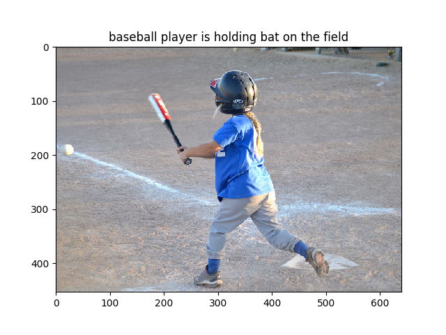
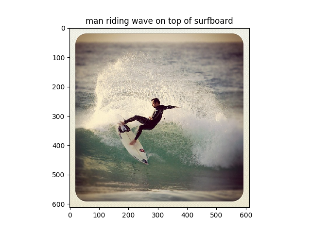

# DeepCaptioning

Yet another implementation of [im2txt](https://github.com/tensorflow/models/tree/master/research/im2txt) (show and tell: A Neural Image Caption Generator).

Belows are results generated by DeepCaptioning.

## Results on COCO dataset




## Results on flickr8k dataset


## How to use

To generate a caption you will need to follow these steps.

### Prepare the training data

DeepCaptioning uses the Flickr8k dataset. Please download the dataset from this [link](https://machinelearningmastery.com/prepare-photo-caption-dataset-training-deep-learning-model/).
Create the directory with the name of 'flickr8k' containing the dataset.

First of all, you need to pre-process caption texts which are tokenize, converting to lower case, removing puctuation, and applying some other filters.

```bash
$ python caption_preproc.py
```

The script below creates the captions with special start and end token, which are ground truth captions.

```bash
$ python gen_train_captions.py
```

To generate image features DeepCaptioning uses the pretrained InceptionV3 model. This script generates image features of train and test set and save as pkl.

```bash
$ python gen_image_feats.py
```

Finally generate the vocabulary from the training captions.

```bash
$ python word_embeddings.py
```

### Train the model

Run the training script.

```bash
$ python train.py
```

If you train the model for 20 epochs(the loss is about 2.5), you will get the results like above.

### Inference

Run the inference script.

```bash
$ python inference.py
```

This inference script selects the target image at random from the test image list.

## License

MIT